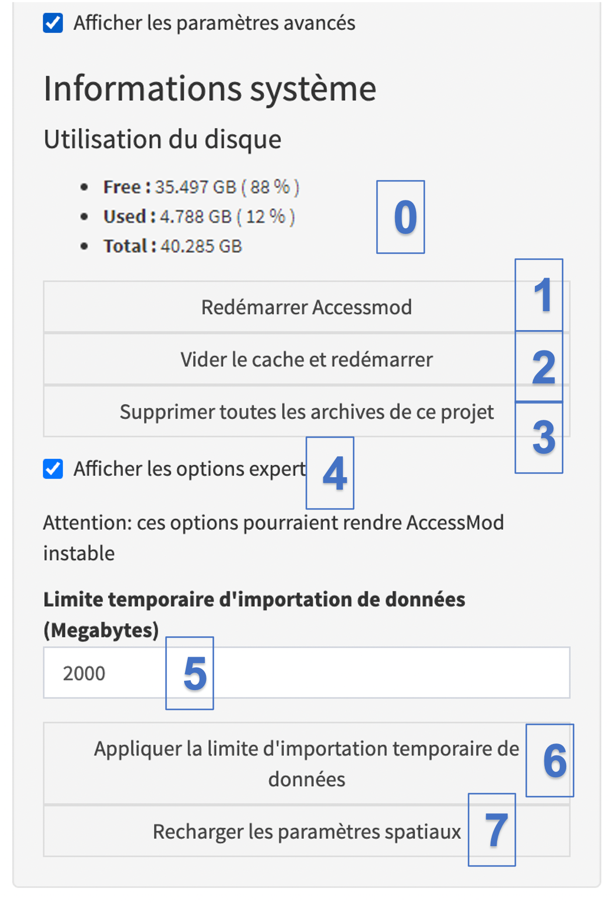

Cochez la case "Afficher les paramètres avancés" dans le module Paramètres pour accéder aux informations et fonctionnalités suivantes:

{width="320"}

(0) La partie «Informations système» du panneau répertorie les mesures utiles de l’utilisation du disque:

-   ["Libre":]{.underline} espace disque disponible sur la machine virtuelle AccessMod, en GB et pourcentage du total disponible
-   ["Utilisé"]{.underline}: espace disque actuellement utilisé dans la VM, en GB et pourcentage du total disponible
-   ["Total"]{.underline}: Espace disque total dans la VM, en GB. L'espace disque par défaut alloué à la machine virtuelle AccessMod lors de son importation dans VirtualBox est de 40 GB.

Dans la version Docker d'ACessMod, ces mesures peuvent être érronnées.

\(1\) Le bouton "Redémarrer AccessMod" redémarre AccessMod. En cliquant dessus, AccessMod redémarrera sur la machine virtuelle et rechargera donc AccessMod dans votre navigateur. Cela peut être utile dans de rares cas où AccessMod devient instable ou se fige.

\(2\) Le bouton "Vider le cache et redémarrer"efface le cache et redémarre AccessMod. Par rapport au bouton précédent, celui-ci supprimera les images en cache (stockées) précédemment générées par le module "Carte interactive". Cela permettra de libérer de l'espace disque et de résoudre les problèmes où les images affichées dans "Carte interactive" ne correspondent pas aux derniers résultats (par exemple, lorsque vous avez effectué la même analyse, avec les mêmes balises associées, deux fois). Dans de rares cas, l'effacement du cache peut également arrêter un comportement erratique du module de données.

[(3) L'option "Supprimer toutes les archives de ce projet" supprime toutes les archives qui ont été générées dans le module Données. Les fichiers d'archives, bien que petits, peuvent remplir le disque et il est utile de les supprimer tous s'ils sont trop nombreux.]{.c-blue}

\(4\) La case à cocher "Afficher les options expert" permet d’ouvrir les options expert d’AccessMod. Ces options complètent les options avancées et sont destinées aux utilisateurs ayant un bon niveau de compréhension d'AccessMod.

\(5\) Le champ "Limite temporaire d'importation de données (mégabytes)" permet d'augmenter la limite d'importation de données. Par défaut, cette limite est définie sur 300 mégaoctets (par couche importée individuellement), mais elle peut être étendue à un nombre plus important (jusqu’à 1'000 mégaoctets) si vous devez importer un fichier plus volumineux. Il est néanmoins important de noter que l'augmentation de cette limite et l'importation d'un fichier très volumineux peuvent rendre AccessMod lent ou instable (en fonction des caractéristiques matérielles de votre ordinateur, notamment si vous disposez d'une quantité de mémoire RAM limitée).

\(6\) Le bouton "Appliquer la limite d'importation temporaire de données" applique la limite d'importation de données temporaire définie au point 5.

\(7\) Le bouton "Recharger les paramètres spatiaux" peut recharger les paramètres de données spatiales. En cliquant sur ce bouton, vous pourrez réinitialiser la projection, la résolution et l'étendue de GRASS en fonction du DEM. Cela peut être utile dans le cas peu probable où GRASS planterait au milieu d’une fonction qui modifie la résolution. Dans ce cas, GRASS peut avoir temporairement une résolution erronée et le rechargement des paramètres de données spatiales corrigera ce problème.

------------------------------------------------------------------------
