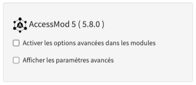

Le module de configuration vous permet de:

1.  Activer les options avancées dans les différents modules

2.  Accéder aux paramètres avancés et aux options expert

{width="300"}

Ces fonctionnalités ne sont pas cochées par défaut. Par conséquent, vous devrez accéder au module de configuration et cocher ces options pour accéder à leurs informations et capacités respectives.

Notez que le numéro de version d'AccessMod apparaît dans la capture d'écran ci-dessus ("5.6.0"). Vous pouvez obtenir un numéro de version différent dans votre installation d’AccessMod car il est mis à jour régulièrement.

La section suivante décrit plus en détail le contenu de ces deux options.396px

## Contenu de cette section

- [5.9.1. Activer les options avancées dans les modules](5-9-1-activer-les-options-avancees-dans-les-modules.qmd)
- [5.9.2. Paramètres avancés et options expertes](5-9-2-parametres-avances-et-options-expertes.qmd)
