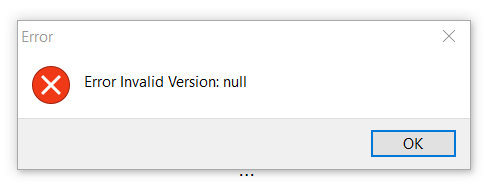

------------------------------------------------------------------------

+--------------------------------------------------+-----------------------------------------------------------------------------------------------------------------------------------------------------------------------------------------------------------------------------+
| {width="50"} | Le lanceur 'electron' est une interface utilisateur conçue pour faciliter l'interaction avec AccessMod et ses fonctions de base.\                                                                                           |
|                                                  | Dans la bannière de menu, les fonctions suivantes sont disponibles (seulement en anglais) :[\                                                                                                                               |
|                                                  | 1. **Project** : Il s'agit d'une méthode très stable pour importer des projets complets dans AccessMod\                                                                                                                     |
|                                                  | 2. **Versions** : Cette fonction permet de mettre à jour, de supprimer et de modifier les versions d'AccessMod.\                                                                                                            |
|                                                  | [3. **Database**:]{.c-orange} Cette fonction vous permet de modifier l'emplacement de stockage des données par défaut dans Docker et de choisir un autre dossier sur votre ordinateur (voir le point 3 de l'installation).\ |
|                                                  | [4. **View**:]{.c-orange} Cela vous permet de rafraîchir la vue, de faire un zoom avant et arrière, de passer en plein écran et d'accéder aux outils de développement.  \                                                   |
|                                                  | [5. **Window**: Il s'agit de moyens supplémentaires pour minimiser et fermer la fenêtre principale d'AccessMod, même si vous êtes en mode plein écran.\                                                                     |
|                                                  | [6. **Edit**:]{.c-orange}]{.c-orange} Ce menu contient des fonctions d'édition de base comme le copier-coller.\                                                                                                             |
|                                                  | ]{.c-orange}                                                                                                                                                                                                                |
+--------------------------------------------------+-----------------------------------------------------------------------------------------------------------------------------------------------------------------------------------------------------------------------------+

⚠️ [**IMPORTANT :** ]{.c-orange}Il pourrait y avoir un conflit entre l'installation d'AccessMod [via la ligne de commande ]{.c-red}(Docker compose) et celle-ci. La première fonctionnera toujours, mais l'accès via le lanceur d'électrons pourrait se bloquer. L'idéal est de choisir l'une des deux méthodes pour installer, exécuter et mettre à jour AccessMod.

------------------------------------------------------------------------

## Sous Windows {#id-9-2-installationd-accessmodvialelanceur-electron-souswindows}

#### Conditions requises {#id-9-2-installationd-accessmodvialelanceur-electron-conditionsrequises}

1.  [Installez ]{.c-red}et démarrez Docker desktop.
2.  Téléchargez le fichier d'installation d'AccessMod depuis GitHub : <https://github.com/unige-geohealth/accessmod/releases/tag/5.8.0>.
3.  Paramètres supplémentaires : \
    -   Dans le menu Windows, tapez "Paramètres" et sélectionnez "Apps". Ensuite, dans la première option "Choisir où obtenir les applications", sélectionnez "[N'importe où]{.c-red}".

#### Installation {#id-9-2-installationd-accessmodvialelanceur-electron-installation}

1.  Exécutez le fichier `accessmod-5.8.0.Setup.exe`.
2.  [S'il y a un avertissement du pare-feu demandant d'autoriser AccessMod à se connecter à des réseaux privés et/ou publics, veuillez autoriser les deux connexions (image uniquement disponible en anglais).\
    \
    {width="400"}\
    ]{.c-orange}
3.  Un message supplémentaire vous demandera de sélectionner soit le volume Docker par défaut, soit un autre répertoire dans lequel AccessMod stockera les fichiers. Un autre répertoire de votre ordinateur doit être accessible en écriture, mais il ne doit pas être modifié par la suite (image uniquement disponible en anglais).\
    \
    {width="500"}
4.  AccessMod va s'ouvrir.

------------------------------------------------------------------------

## Sous Apple {#id-9-2-installationd-accessmodvialelanceur-electron-sousapple}

### Pour Mac (Intel) {#id-9-2-installationd-accessmodvialelanceur-electron-pourmac-intel}

#### Conditions requises {#id-9-2-installationd-accessmodvialelanceur-electron-conditionsrequises-1}

1.  [Installez ]{.c-red}et démarrez Docker desktop.
2.  Téléchargez le fichier d'installation d'AccessMod depuis GitHub : <https://github.com/unige-geohealth/accessmod/releases/tag/5.8.0>.

#### Installation {#id-9-2-installationd-accessmodvialelanceur-electron-installation-1}

1.  Add the installer to the applications, and from there right-click the app and select open. Direct activation is by default rejected by Apple.
2.  A possible error message for invalid version can we waived with OK (image uniquement disponible en anglais).\
    
3.  An additional message will ask you to select either the default Docker volume or another directory for AccessMod to store files. An different directory in your computer should be writable, but it should **not** be modified afterwards.
4.  AccessMod va s'ouvrir.

### Pour Mac (M1) {#id-9-2-installationd-accessmodvialelanceur-electron-pourmac-m1}

#### Conditions requises {#id-9-2-installationd-accessmodvialelanceur-electron-conditionsrequises-2}

1.  [Installez ]{.c-red}et démarrez Docker desktop.
2.  Téléchargez le fichier d'installation d'AccessMod depuis GitHub : <https://github.com/unige-geohealth/accessmod/releases/tag/5.8.0>. **Actuellement, cette image ne fonctionne que pour les ordinateurs Apple x86/intel, mais elle vous permettra de télécharger via le lanceur une version (\>5.7.20) qui fonctionne avec les puces M1.**

#### Installation {#id-9-2-installationd-accessmodvialelanceur-electron-installation-2}

1.  Les étapes d'installation 1 à 3 pour Intel Mac s'appliquent également pour M1. Cependant, seule la bannière du menu s'ouvrira, et un message d'erreur éventuel pourrait s'afficher pour signaler que l'application n'a pas pu être chargée. Acceptez en cliquant sur OK (image uniquement disponible en anglais).\
    \
    {width="392"}
2.  Dans la bannière de menu, sélectionnez Versions et dans le sous-menu Tout à distance, sélectionnez toute version supérieure à 5.7.20. Si votre version actuelle est 5.8.0, vous pouvez installer une version inférieure ou supérieure, puis supprimer l'image 5.8.0 de Docker et la réinstaller ultérieurement par cette méthode (image uniquement disponible en anglais). \
    
3.  AccessMod va s'ouvrir.

## Sous Linux {#id-9-2-installationd-accessmodvialelanceur-electron-souslinux}

Pour installer AccessMod, suivez les étapes du [tutoriel en ligne de commande]{.c-red}.
