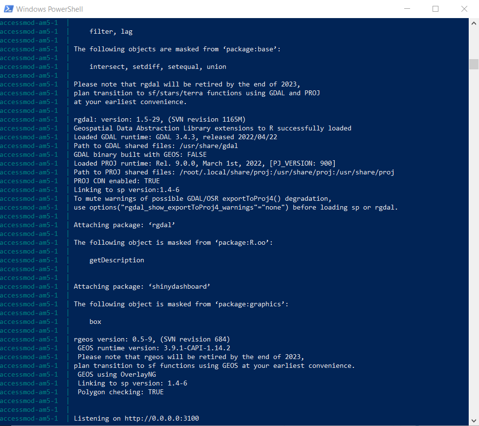
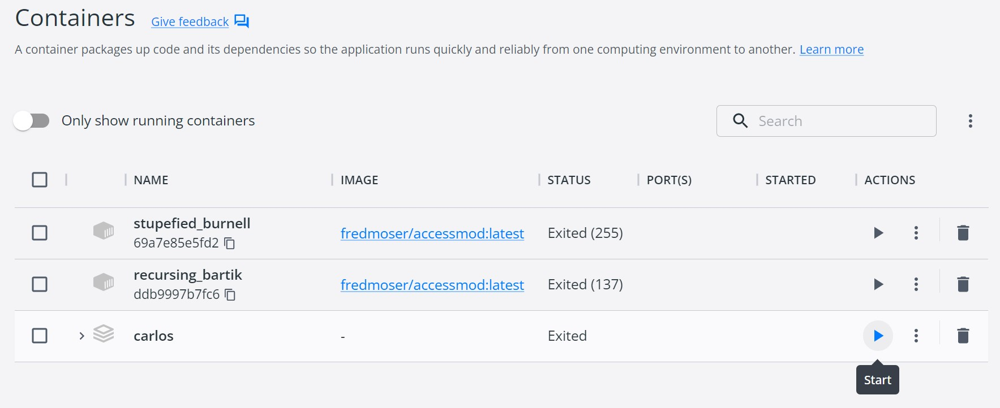
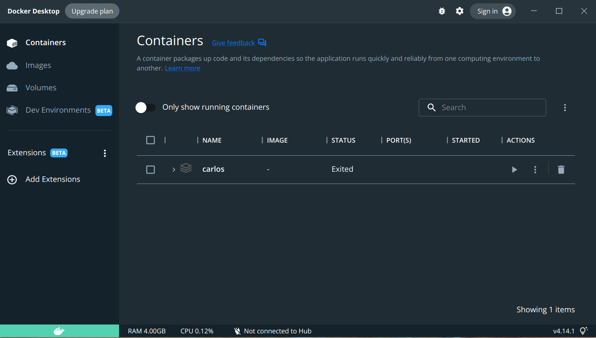

⚠️ [**IMPORTANT :** Il pourrait y avoir un conflit entre l'installation d'AccessMod via le lanceur d'électrons et celle-ci. Cette méthode fonctionnera toujours, mais l'accès via le lanceur d'électrons pourrait se bloquer. Idéalement, choisissez l'une des deux méthodes pour installer, exécuter et mettre à jour AccessMod.]{.c-orange}

## Sous Windows {#id-9-3-installationd-accessmodviadockercompose-lignedecommande-souswindows}

#### Première utilisation : {#id-9-3-installationd-accessmodviadockercompose-lignedecommande-premiereutilisation}

Cette procédure peut être effectuée soit dans le **command prompt**, soit dans Windows **PowerShell**. Les deux programmes sont installés par défaut dans Windows.

Les conditions préalables à cette procédure sont les suivantes :

-   Téléchargez et installez Docker Desktop, qui inclut par défaut Docker Compose.
-   Téléchargez un fichier ‘`docker-compose.yml`’ préconfiguré depuis <https://www.dropbox.com/s/m7ddlvjvs2rpzzu/docker-compose.yml?dl=0>. Ce fichier commande le téléchargement et l'utilisation de la dernière version d'AccessMod.\
    Vous pouvez également créer vous-même le fichier ‘`docker-compose.yml`’ en copiant le texte suivant dans un éditeur de texte tel que Notepad++ en conservant le nom exact du fichier, son extension et son langage (YAML) :
    -   Par défaut, ce code demande la dernière version dans 'image : fredmoser/accessmod:latest', mais vous pouvez aussi charger une des versions précédentes disponibles en remplaçant 'latest' par : `5.7.0`, `5.7.17`, `5.7.18`, or `5.8.0`

``` yaml
version: "3.8"

services:
  am5:
    image: fredmoser/accessmod:latest
    ports:
      - "3180:3100"
    command: ["Rscript", "--vanilla", "run.r", "3100", "5100", "5180"]
    volumes: 
      - am5_dev_tmp:/tmp
      - am5_dev_data:/data/dbgrass
      - am5_dev_cache:/data/cache
      - am5_dev_logs:/data/logs

volumes:
  am5_dev_tmp:
  am5_dev_data:
  am5_dev_cache:
  am5_dev_logs:
```

Suivez les étapes suivantes pour télécharger et exécuter AccessMod à partir de la ligne de commande :

1.  Placez le fichier '`docker-compose.yml`’ que vous avez téléchargé ou créé dans un dossier facile à localiser (**idéalement, pas dans une longue série de sous-dossiers**).
2.  **Démarrez le Docker desktop**.
3.  Ouvrez l'application Windows '**PowerShell**' ou '**Command Prompt**', par exemple en ouvrant le menu Windows et en tapant '**PowerShell**'.
4.  Depuis la ligne de commande, accédez au dossier dans lequel vous avez placé le fichier '`docker-compose.yml`' à l'aide des commandes suivantes :
    -   Tapez '`cd..`' suivi d'entrée, pour aller à un niveau supérieur dans l'arborescence des fichiers, à savoir vers votre lecteur principal C :
    -   Tapez '`ls`' suivi d'entrée, pour afficher une liste des fichiers et des dossiers contenus dans votre dossier actuel. Cela vous donne des informations sur les dossiers dans lesquels vous pouvez aller.
    -   Tapez '`cd NomDuDossier`' suivi d'entrée, pour accéder à l'un des dossiers (s'il en existe) dans votre dossier actuel. Par exemple : `cd Documents`
5.  Lorsque vous atteignez le dossier dans lequel le fichier '`docker-compose.yml`' est stocké, tapez dans la ligne de commande : 'docker compose up', suivi de la touche Entrée. L'extraction et la compilation commenceront en affichant un écran similaire à celui-ci (exemple avec PowerShell) :\
    {width="600"}\
    -   Cela créera une image dans Docker, et un conteneur où vos données seront stockées.
    -   Pour cette première exécution, ne fermez pas **PowerShell**, car il contrôle la l'image en cours.
6.  Pour commencer à travailler avec AccessMod, ouvrez votre navigateur et tapez dans la barre d'adresse : '`localhost:3180`' suivi de la touche Entrée. La dernière version d'AccessMod s'ouvrira.
7.  Pour finaliser votre travail et fermer correctement la machine virtuelle, allez dans votre ligne de commande **PowerShell** et tapez la combinaison de touches **ctrl** + **c**, attendez quelques secondes jusqu'à ce que le processus se ferme, puis tapez : '`exit`' ou fermez la fenêtre.

#### Deuxième utilisation et utilisation continue {#id-9-3-installationd-accessmodviadockercompose-lignedecommande-deuxiemeutilisationetutilisationcontinue}

Le processus précédent peut être exécuté à chaque fois, et Docker compose ne téléchargera et ne mettra à jour que les fichiers nécessaires, au cas où il y aurait une mise à jour mineure ou majeure. S'il n'y a pas de mise à jour, il démarrera le conteneur immédiatement.

⭐ Cependant, après la première installation, l'image téléchargée auparavant avec **PowerShell** peut maintenant être exécutée directement depuis Docker en suivant les étapes suivantes :

1.  **Démarrez Docker desktop.**
2.  Allez dans "**Conteneurs**" dans la liste de gauche de l'écran principal. Vous y trouverez le conteneur créé précédemment.\
    1.  Démarrez AccessMod en cliquant sur *l'icône de Start* dans la colonne des actions. \
        \
         
    2.  Ouvrez votre navigateur et tapez : `localhost:3180`
    3.  Après avoir terminé, fermez le navigateur et arrêtez l'image en utilisant *l'icône d'arrêt* dans la colonne d'action du conteneur que vous avez lancé auparavant.

------------------------------------------------------------------------

## Sous Apple {#id-9-3-installationd-accessmodviadockercompose-lignedecommande-sousapple}

#### Installation et exécution d'AccessMod {#id-9-3-installationd-accessmodviadockercompose-lignedecommande-installationetexecutiond-accessmod}

1.  Téléchargez le fichier préconfiguré ‘`docker-compose.yml`’ depuis <https://www.dropbox.com/preview/Public/docker-compose.yml>, et enregistrez le fichier dans un emplacement connu.
2.  Vous pouvez également ouvrir un éditeur de texte, par exemple l'application TextEdit, créer le fichier YAML en tapant : `touch docker-compose.yml`. Puis éditez le fichier et copiez/collez le contenu dans la section Windows [ci-dessus]{.c-yellow}.
3.  Dans le Terminal, naviguez jusqu'à l'emplacement de votre fichier `'docker-compose.yml'` et tapez : `docker compose up`
4.  Le téléchargement et la compilation des données vont commencer.
5.  Pour commencer à travailler dans AccessMod, ouvrez votre navigateur et tapez dans la barre d'adresse : '`localhost:3180`' suivi d'entrée. La dernière version d'AccessMod s'ouvre.
6.  Pour finaliser votre travail et fermer correctement la machine virtuelle, allez dans votre Terminal et tapez la combinaison de touches **ctrl** + **c**, attendez quelques secondes jusqu'à ce que le processus se ferme, puis tapez : 'exit' ou fermez la fenêtre.

#### Deuxième utilisation et utilisation continue {#id-9-3-installationd-accessmodviadockercompose-lignedecommande-deuxiemeutilisationetutilisationcontinue-1}

1.  Après la première installation, l'image téléchargée auparavant avec le Terminal peut maintenant être exécutée directement depuis Docker.

    1.  **Démarrez Docker Desktop**.
    2.  Allez dans "**Conteneurs**" dans la liste de gauche de l'écran principal. Vous y trouverez le conteneur créé précédemment, avec le nom du dossier à partir duquel il a été créé.
    3.  Démarrez AccessMod en cliquant sur *l'icône de Start* dans la colonne des actions.
    4.  Ouvrez votre navigateur et tapez : `localhost:3180`
    5.  Après avoir terminé, fermez le navigateur et arrêtez l'image en utilisant *l'icône d'arrêt* dans la colonne d'action du conteneur que vous avez lancé auparavant.

------------------------------------------------------------------------

## Sous Ubuntu {#id-9-3-installationd-accessmodviadockercompose-lignedecommande-sousubuntu}

#### Installation et exécution d'AccessMod {#id-9-3-installationd-accessmodviadockercompose-lignedecommande-installationetexecutiond-accessmod-1}

1.  Téléchargez le fichier préconfiguré ‘`docker-compose.yml`’ depuis <https://www.dropbox.com/preview/Public/docker-compose.yml>, et enregistrez le fichier dans un emplacement connu.
2.  Alternativement, ouvrez l'éditeur de texte dans Ubuntu et copiez/collez le contenu de `docker-compose.yml `dans la section Windows ci-dessus. Sélectionnez ensuite le langage YAML et enregistrez le fichier dans un emplacement connu sous le nom de '`docker-compose.yml`'.
3.  Dans le Terminal, naviguez jusqu'à l'emplacement de votre fichier '`docker-compose.yml`' et tapez : `docker compose up`
4.  Le téléchargement et la compilation des données vont commencer.
5.  Pour commencer à travailler dans AccessMod, ouvrez votre navigateur et tapez dans la barre d'adresse : '`localhost:3180`' suivi d'entrée. La dernière version d'AccessMod s'ouvre.
6.  Pour finaliser votre travail et fermer correctement la machine virtuelle, allez dans votre Terminal et tapez la combinaison de touches **ctrl** + **c**, attendez quelques secondes jusqu'à ce que le processus se ferme, puis tapez : '`exit`' ou fermez la fenêtre.

#### Deuxième utilisation et utilisation continue {#id-9-3-installationd-accessmodviadockercompose-lignedecommande-deuxiemeutilisationetutilisationcontinue-2}

1.  Après la première installation, l'image téléchargée auparavant avec le Terminal peut maintenant être exécutée directement depuis Docker.

    1.  **Démarrez Docker Desktop**.
    2.  Allez dans "**Conteneurs**" dans la liste de gauche de l'écran principal. Vous y trouverez le conteneur créé précédemment, avec le nom du dossier à partir duquel il a été créé.
    3.  Démarrez AccessMod en cliquant sur *l'icône de Start* dans la colonne des actions.\
        \
        \
    4.  Ouvrez votre navigateur et tapez : `localhost:3180`
    5.  Après avoir terminé, fermez le navigateur et arrêtez l'image en utilisant *l'icône d'arrêt* dans la colonne d'action du conteneur que vous avez lancé auparavant\
         \
        \

2.  À partir du terminal, suivez ces étapes simples (Pour plus de détails, voir <https://docs.docker.com/engine/reference/commandline/container_start/>):
    1.  Démarrer Docker avec : `$systemctl --user start docker-desktop`

    2.  Trouvez le nom du conteneur avec lequel vous voulez commencer : `$docker container ls`\
        

    3.  Lancé votre conteneur avec :  `$docker container start <ConteneurNom>` e.g. `carlos-am-5-1`

    4.  Ouvrez votre navigateur et tapez :`localhost:3180`

    5.  Finalement, arrêtez votre conteneur avec : `$docker container stop <ConteneurNom>`
