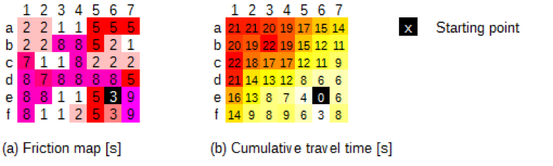

Lors d'une analyse d'accessibilité dans AccessMod, les étapes suivantes sont effectuées:

1.  Une surface de friction (voir figure ci-dessous) est d'abord créée en fonction du scénario de déplacement et de l'occupation du sol fusionnée. Cette surface représente le temps nécessaire pour traverser une cellule du nord vers le sud ou d'est en ouest, quelle que soit sa direction.
2.  La liste des points de départ (structures) est créée à l'aide des structures choisies dans le jeu de données des structures sanitaires.
3.  L'analyse commence par utiliser l'algorithme isotrope (basé sur <https://grass.osgeo.org/grass72/manuals/r.cost.html>) ou anisotrope (basé sur <https://grass.osgeo.org/grass72/manuals/r>[.walk.html](https://grass.osgeo.org/grass72/manuals/r)), avec l’ensemble des structures choisies comme points de départ et la surface de friction comme contrainte de déplacement. Le modèle numérique d'altitude (DEM) est ajouté pour une analyse anisotrope et prend donc en compte l'influence de la pente sur la vitesse de déplacement en fonction du sens de déplacement. Les deux algorithmes déterminent le temps de parcours cumulé du déplacement vers chaque cellule de la surface donnée à partir des points de départ entrés. Il produit une couche de format raster en sortie (panneau *b* dans Figure ci-dessous) dans laquelle chaque cellule contient le temps de parcours cumulé jusqu'au centre de santé le plus proche (en temps et non en distance) en fonction du sens de déplacement spécifié par l'utilisateur.

**Exemple de carte de friction et résultat pour l'analyse d'accessibilité\
**

------------------------------------------------------------------------
