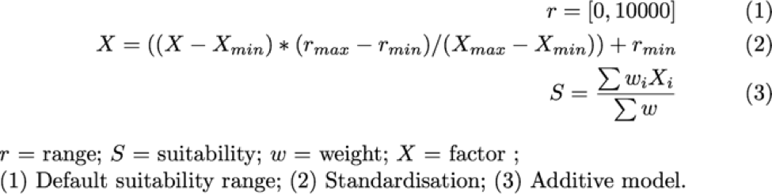

L'analyse de mise à l'échelle incluse dans AccessMod permet de trouver les emplacements les plus appropriés pour les structures de santé afin de mettre à l'échelle un réseau existant. La méthodologie de mise à l'échelle utilise plusieurs variables pour produire une carte composite pondérée de pertinence avec une approche de modèle additive.

La première étape consiste à exclure de l'analyse toutes les cellules des zones d'exclusion. Une fois cette opération effectuée, une analyse de l'accessibilité physique est effectuée sur toutes les cellules restantes présentant la valeur la plus élevée de la couche de distribution de pertinence.

Le site (cellule) couvrant la population la plus nombreuse est celui sélectionné pour l’emplacement d’une nouvelle structure de santé. Le type de structure placé sur ce site est ensuite décidé en fonction du contenu de la nouvelle table d’information sur la structure de santé. Une seule structure est donc créée à l’emplacement, ce qui maximise à la fois la pertinence et la couverture de la population. Le processus passe ensuite à l'itération suivante pour localiser une autre nouvelle structure. L'algorithme dépend fortement des facteurs d'exclusion et de pertinence définis par l'utilisateur, ainsi que de la qualité des données d'entrée.

**Zones d'exclusion**

Les zones d'exclusion sont définies par l'utilisateur en saisissant un nombre de vecteurs (points, polygones) ou de jeux de données raster. Les zones d'exclusion typiques peuvent représenter des zones militaires, des zones humides, des terres privées, etc. L'utilisateur peut également définir une zone tampon (en kilomètres) en dehors de la zone d'exclusion qui sera prise en compte pour l'exclusion. Ceci est particulièrement utile lorsque l'utilisateur souhaite éviter de localiser une nouvelle installation à moins de 5 km des installations existantes (une contrainte au Burkina Faso par exemple).

**Pertinence en dehors des zones d'exclusion**

La manière dont on définit et combine les facteurs de pertinence a été soigneusement étudiée pour permettre une flexibilité maximale, de sorte que les utilisateurs puissent définir une gamme de modèles d’adaptabilité, du plus simple au plus complexe, afin de répondre à des contraintes nationales / régionales spécifiques.

La décision sur les facteurs à inclure fait suite au processus de consultation qui a eu lieu en été 2015, lorsque nous avons recueilli les besoins et les idées (du personnel de santé de l'OMS et d'autres organisations) sur la manière de déterminer si le site est adapté à l'emplacement de nouvelles structures de santé.

Une fois la zone d'exclusion appliquée, les zones non exclues doivent être hiérarchisées en fonction de la combinaison de facteurs de pertinence définis par l'utilisateur. Ce modèle peut inclure n'importe quelle combinaison des facteurs suivants pour obtenir un indice de pertinence pour chaque cellule non exclue de la zone d'étude:

\- *Somme de la population dans un rayon défini utilisé* (en kilomètres) (par exemple, cela nous permet de cibler les zones les plus peuplées)

\- *Distance euclidienne à partir d'éléments d'un jeu de données d'entrée* (ex: routes, structures de santé existantes) (par exemple, cela nous permet de hiérarchiser les nouvelles structures proches des routes ou du réseau de structures de santé particulières telles que celles fournissant des soins obstétricaux et néonatals d'urgence (SONU))

\- *Durée du trajet vers / depuis les éléments d'un jeu de données d'entrée* (ceci prend en compte le temps de trajet plutôt que la distance euclidienne et peut être plus réaliste en fonction des jeux de données et du but de l'exercice de mise à l'échelle)

\- *Carte générique des priorités* (elle prend tout jeu de données raster en entrée et utilise ses valeurs de cellule comme priorités relatives. Cela donne un degré élevé de flexibilité, car la priorité de mise à l'échelle peut provenir de tout autre outil externe, tel qu'un outil qui hiérarchiserait les régions en fonction des contraintes économiques)

 Pour chacun des facteurs de pertinence, l'utilisateur doit définir si des valeurs plus élevées sont plus appropriées ou moins appropriées. Par défaut, les poids relatifs parmi les facteurs du modèle sont égaux, mais l'utilisateur peut les modifier, ce qui donne plus d'importance à un ou plusieurs facteurs.

 Le modèle additif combine ensuite les facteurs définis dans la partie (3) de l'équation ci-dessous et génère la carte de pertinence du raster.

La procédure de standardisation est tirée de: <http://support.esri.com/cn/knowledgebase/techarticles/detail/30961>

**Processus**

Une fois le modèle défini et validé, AccessMod calcule chaque règle d’exclusion et crée une carte des candidats potentiels. Seuls les candidats sont pris en compte dans les prochaines étapes. L'algorithme traite ensuite de manière itérative à travers les étapes suivantes:

\- L'algorithme redimensionne tous les facteurs définis dans l'analyse de pertinence, applique la pondération relative définie par l'utilisateur entre les facteurs et combine les versions redimensionnées dans une carte de pertinence.

\- L’algorithme extrait tous les emplacements présentant la valeur de pertinence la plus élevée et lance une analyse d’accessibilité pour chacun d’eux en fonction du temps de trajet maximal défini dans les paramètres d’analyse.

\- La couverture d'accessibilité résultante (nombre de patients potentiels) pour chaque site est ensuite utilisée pour sélectionner le site présentant la couverture la plus élevée. Ce site est l'endroit où une nouvelle structure de santé sera située.

La valeur de couverture d'accessibilité pour le site sélectionné est comparée au tableau de capacité d'entrée, de sorte que le type de structure approprié, son étiquette et une capacité maximale soient attribués au(x) candidat(s). Cette étape peut prendre beaucoup de temps, en fonction du nombre d'emplacements à évaluer (c'est-à-dire, si les modèles de pertinence ne sont pas assez discriminants et que de nombreux emplacements ont la même pertinence).

\- L’emplacement avec la meilleure couverture (c’est-à-dire où une nouvelle installation est trouvée) est conservé et le polygone représentant l'aire de captage est stocké.

\- La prochaine itération est lancée pour trouver l'emplacement de la prochaine structure de santé.

 **Fin du processus**

Le processus est terminé lorsque l'une des limites suivantes définies par l'utilisateur est atteinte:

\- le pourcentage de la population totale couverte par le réseau de structures de santé mis à l'échelle.

\- La limite informatique maximale définie par l'utilisateur.

\- nombre de nouvelles installations souhaitées.

------------------------------------------------------------------------
