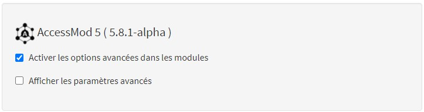
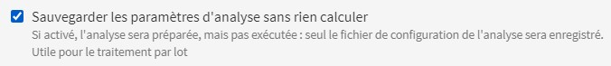

## Pour les experts : direct au point {#annexe8-fonctionnalite-replay-pourlesexperts-directaupoint}

``` applescript
# Clonez le répertoire :
git clone git@gitlab.unige.ch:geohealth/accessmod_replay_demo.git
cd accessmod_replay_demo
# Lancez le script :
./script.sh
# Vérifiez le résultat:
gdalinfo -stats out/1_120/raster_travel_time_original/raster_travel_time_original.img
```

## Procédure pas à pas {#annexe8-fonctionnalite-replay-procedurepasapas}

### Conditions requises {#annexe8-fonctionnalite-replay-conditionsrequises}

-   Pour utiliser la fonction Replay, il est conseillé d'avoir une solide connaissance de R et une connaissance de base de Bash.
-   La fonction Replay nécessite une commande bash pour s'exécuter. Un langage qui ne peut être utilisé que sous **Linux** et **Mac OS**. Pour l'utiliser sous Windows, l'approche la plus simple consiste à installer une distro basée sur Linux à partir du Microsoft Store, par exemple Ubuntu 20.04 LTS, ou le Windows Subsystem Linux (WSL), qui est de toute façon nécessaire pour exécuter Docker desktop. Ensuite, vous pouvez utiliser la ligne de commande de cette distro pour exécuter les commandes bash de Replay.

Après avoir installé l'une des distros, il y aura un court processus d'installation et d'activation qui vous demandera de définir un nom d'utilisateur et un mot de passe administrateur.

{width="1000"}

-   Il est nécessaire d'avoir installé **Docker desktop** et **AccessMod**. Pour plus d'instructions sur la façon d'installer Docker desktop, allez [ici]{.c-red}, et pour AccessMod soit via la ligne de commande regardez[ ici]{.c-red}, soit via le lanceur electron, ici.

### **Préparation des fichiers** {#annexe8-fonctionnalite-replay-preparationdesfichiers}

Pour utiliser la fonction Replay, il est nécessaire de préparer d'abord les données de base et la configuration générale de l'analyse dans AccessMod.

1.  Démarrez Docker desktop

2.  Lancez AccessMod

3.  Dans le panneau de gauche, allez dans Paramètres et sélectionnez "*Activer les options avancées dans les modules*" (image uniquement disponible en anglais).\
    \

    

4.  Pour préparer votre fichier de configuration, chargez les couches requises et préparez l'analyse comme d'habitude, dans l'outil sélectionné. Pour éviter les doubles calculs, sélectionnez l'option avancée "Enregistrer les paramètres d'analyse sans calcul". Cela permettra d'enregistrer vos noms de fichiers et vos paramètres d'analyse dans un fichier de configuration `.JSON` (image uniquement disponible en anglais).\
    \
    {width="500"}

5.  Enfin, exportez votre fichier de configuration individuel et l'ensemble du projet depuis AccessMod.

**Le replay : les dossiers**

La fonction Replay utilise au moins deux fichiers en entrée : le **projet AccessMod** (`.am5p`) comme données d'entrée, et le **fichier de configuration** (`config.json`) comme paramètres d'analyse. Cependant, sa véritable valeur provient de l'utilisation de **fichiers supplémentaires** (`.json`, `.``rds`, `.txt`, etc.) pour modifier automatiquement les paramètres d'analyse.

### **Description des fichiers** {#annexe8-fonctionnalite-replay-descriptiondesfichiers}

Le fichier bash (**`script.sh`**) joue le rôle de coordinateur de l'ensemble du processus. Il commence par identifier l'image AccessMod, le dossier de sortie et les fichiers concernés (`.am5p`, `.R`, `.json`). Il vérifie ensuite si ces fichiers sont bien présents, pour enfin procéder à l'exécution de Docker avec ces fichiers en entrée et exécuter le script R.

Plus précisément, le script bash appelle Docker et exécute des commandes à l'intérieur d'un conteneur Docker créé à partir d'une image spécifique d'AccessMod. Il monte dans le conteneur les fichiers d'entrée précédents (`project.am5p`, `config.json`, etc.), ainsi que le script R (script.R) qui comprend toutes les instructions pour l'analyse. Le script bash appelle finalement une session R pour exécuter le script R, qui utilise le projet AccessMod comme base de **données locale**, le **`config.json`** comme source d'information pour créer une **liste de paramètres par défaut**, ainsi que tous les fichiers d'entrée supplémentaires comme **objets R** qui fournissent de nouveaux paramètres pour l'analyse. Le script R exporte également les résultats dans le dossier outputs (`/out`), et rédige un fichier de résumé (`summary.json`).

Enfin, le dossier de sortie (**`/out`**) est à l'origine un dossier vide où tous les résultats de sortie seront stockés dans des dossiers individuels pour chaque exécution séquentielle selon les paramètres décrits par le fichier **`config.json`** dans R.

*Actuellement, tous les fichiers et dossiers doivent se trouver dans le même répertoire, mais des modifications futures devraient permettre de travailler sur des exécutions multi-projets, en conservant uniquement les entrées requises dans un répertoire dédié et en y stockant ultérieurement les sorties spécifiques.*

\

{width="800"}

### **Usage unique : mise à jour manuelle des paramètres** {#annexe8-fonctionnalite-replay-usageunique-miseajourmanuelledesparametres}

Si vous **n'êtes pas** intéressé par l'exécution d'une analyse séquentielle qui modifie les paramètres automatiquement, mais que vous souhaitez plutôt exécuter un ou quelques modèles, il est possible de modifier manuellement les paramètres du fichier **`config.json`**  (exemple ci-dessous), qui apparaissent comme des arguments (`"args"`). Effectuez toutes les modifications à partir d'un éditeur de texte tel que **Notepad++**. Dans ce cas, il ne sera pas nécessaire d'inclure un fichier d'entrée supplémentaire. Si le type d'analyse (accessibilité, couverture géographique, référencement, etc.) change, il est fortement recommandé de générer un nouveau fichier `config.json` dans AccessMod.

``` applescript
"args": {
    "inputMerged": "rLandCoverMerged__demo",
    "inputPop": "rPopulation__demo_patients",
    "inputHf": "vFacility__demo",
    "inputZoneAdmin": null,
    "outputPopResidual": "rPopulationResidual__batch",
    "outputHfCatchment": "vCatchment__batch",
    "outputPopBarrier": "rPopulationOnBarrier__batch",
    "outputTableCapacity": "tCapacityStat__batch",
    "outputTableZonal": "tZonalStat__batch",
    "outputSpeed": "rSpeed__batch",
    "outputFriction": "rFriction__batch",
    "typeAnalysis": "anisotropic",
    "knightMove": false,
    "removeCapted": true,
    "vectCatch": true,
    "popOnBarrier": false,
    "towardsFacilities": true,
    "radius": 5000,
    "maxTravelTime": 120,
    "maxTravelTimeOrder": 120,
    "useMaxSpeedMask": false,
    "hfIdx": "cat",
    "nameField": "name",
    "capField": "capacity",
    "orderField": "capacity",
    "ignoreCapacity": false,
    "addColumnPopOrigTravelTime": false,
    "addColumnsPopCoverageExtended": false,
    "zonalCoverage": false,
    "zoneFieldId": null,
    "zoneFieldLabel": null,
    "hfOrder": "tableOrder",
    "hfOrderSorting": "hfOrderDesc",
    "tableScenario": [
      { "class": 1, "label": "Built_area", "speed": 6, "mode": "BICYCLING" },
      { "class": 2,
        "label": "Low_dense_vegetation",
        "speed": 4,
        "mode": "WALKING" },
      { "class": 3,
        "label": "Dense_vegetation",
        "speed": 2,
        "mode": "WALKING" },
      { "class": 1001,
        "label": "Main road",
        "speed": 100,
        "mode": "MOTORIZED" },
      { "class": 1002, "label": "Secondary", "speed": 80, "mode": "MOTORIZED" },
      { "class": 1003, "label": "Tertiary", "speed": 50, "mode": "MOTORIZED" }
```

### **Utilisation séquentielle : mise à jour automatique du paramètre** {#annexe8-fonctionnalite-replay-utilisationsequentielle-miseajourautomatiqueduparametre}

Pour une utilisation séquentielle, le fichier **`config.json`** sert de modèle et de ligne de base pour établir les paramètres à utiliser dans chaque analyse séquentielle, il n'est donc pas nécessaire de le modifier. Au lieu de cela, un fichier (`.json`, `.rds`, `.txt`, etc.) qui inclut de nouveaux paramètres et peut être facilement lu dans R est importé comme une liste à boucler et à modifier le paramètre par défaut, par ex :

``` applescript
{
  "scenarios": {
    "MIXED": [
      { "class": 1, "speed": 6, "mode": "BICYCLING" },
      { "class": 2, "speed": 4, "mode": "WALKING" },
      { "class": 3, "speed": 2, "mode": "WALKING" },
      { "class": 1001, "speed": 100, "mode": "MOTORIZED" },
      { "class": 1002, "speed": 80, "mode": "MOTORIZED" },
      { "class": 1003, "speed": 50, "mode": "MOTORIZED" }
    ],
    "MOTORIZED": [
      { "class": 1, "speed": 15, "mode": "MOTORIZED" },
      { "class": 2, "speed": 10, "mode": "MOTORIZED" },
      { "class": 3, "speed": 5, "mode": "MOTORIZED" },
      { "class": 1001, "speed": 100, "mode": "MOTORIZED" },
      { "class": 1002, "speed": 80, "mode": "MOTORIZED" },
      { "class": 1003, "speed": 50, "mode": "MOTORIZED" }
    ],
    "BICYCLING": [
      { "class": 1, "speed": 15, "mode": "BICYCLING" },
      { "class": 2, "speed": 4, "mode": "BICYCLING" },
      { "class": 3, "speed": 2, "mode": "BICYCLING" },
      { "class": 1001, "speed": 15, "mode": "BICYCLING" },
      { "class": 1002, "speed": 15, "mode": "BICYCLING" },
      { "class": 1003, "speed": 15, "mode": "BICYCLING" }
    ],
    "WALKING": [
      { "class": 1, "speed": 5, "mode": "WALKING" },
      { "class": 2, "speed": 4, "mode": "WALKING" },
      { "class": 3, "speed": 2, "mode": "WALKING" },
      { "class": 1001, "speed": 5, "mode": "WALKING" },
      { "class": 1002, "speed": 5, "mode": "WALKING" },
      { "class": 1003, "speed": 5, "mode": "WALKING" }
    ]
  }
}
```

### **Exécution de l'analyse** {#annexe8-fonctionnalite-replay-executiondel-analyse}

À partir de votre terminal sous Mac OS, Linux OS ou une distro basée sur Linux sous Windows, naviguez jusqu'au répertoire où sont stockés vos fichiers. De là, exécutez le script bash en tapant son nom :

`$ ./script.sh`

Retrouvez un exemple complet comprenant les fichiers et le code présentés auparavant <https://github.com/unige-geohealth/accessmod/tree/main/replay/examples/loop_accessibility_simple>**.**

## **Notes importantes :** {#annexe8-fonctionnalite-replay-notesimportantes}

-   Il est fondamental de vérifier les noms des fichiers à utiliser, et que ces noms correspondent à la façon dont ils sont appelés dans les différents fichiers (`bash`, `.R`, `.JSON`, etc.).
-   Il est possible d'apporter autant de modifications que possible, pour autant que vous sachiez ce que vous faites. Le fichier .R d'entrée est particulièrement adapté pour inclure des commandes supplémentaires permettant de modifier les rasters, vecteurs et tableaux de sortie. Voici la liste actuelle des paquets R déjà inclus dans l'image AccessMod pour Docker :

[`assertthat, base, base64enc, bit, dplyr, bit64, blob, bslib, cachem, cellranger, cli, clipr, Codetools, colorspace, commonmark, compiler, cpp11, Crayon, Crosstalk, curl, data.table, datasets, DBI, digest, ellipsis, fansi, farver, fastmap, fontawesome, forcats, foreach, foreign, fs, future, gdalUtils, generics, ggplot2, globals, glue, graphics, grDevices, grid, gridExtra , gtable, haven, hms, htmltools, htmlwidgets, httpuv, isoband, iterators, jquerylib, jsonlite, labeling, later, lattice, lazyeval, leaflet, leaflet, lifecycle, listenv, magrittr, markdown, MASS, Matrix, memoise, methods, mgcv, mime, munsell, nlme, openxlsx, parallel, parallelly, pillar, rlang, pkgconfig, plogr, plyr, png, pool, prettyunits, progress, promises, providers, purrr, R.methodsS3, R.oo, R.utils, R6, rappdirs, raster, RColorBrewer, Rcpp, readr, readxl, rematch, rgdal, rgeos, rgrass7, rio, RSQLite, sass, scales, semver, shiny, shinydashboard, sourcetools, sp, splines, stats, stats4, stevedore, stringi, stringr, tcltk, terra, tibble, tidyselect, tools, tzdb, utf8, utils, vctrs, viridis, viridisLite, vroom, withr, xfun, XML, xml2, xtable, yaml, zip`]{.c-blue}

-   Il s'agit d'un cadre et non d'une recette pour faire des analyses, donc tous les scripts (y compris le bash) peuvent être modifiés en fonction des besoins des utilisateurs.

------------------------------------------------------------------------
